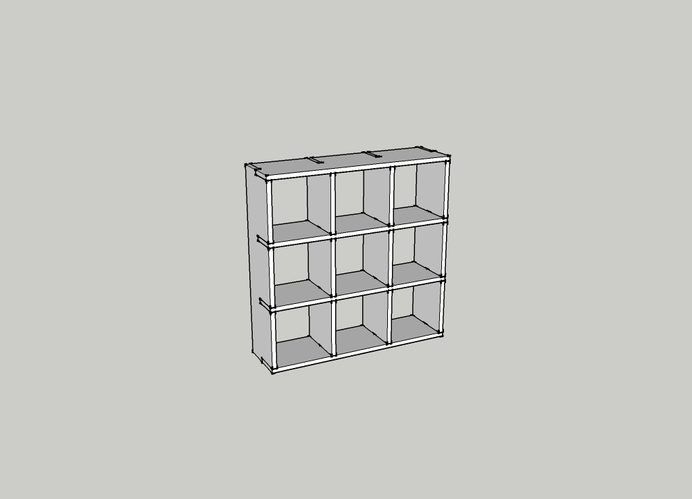
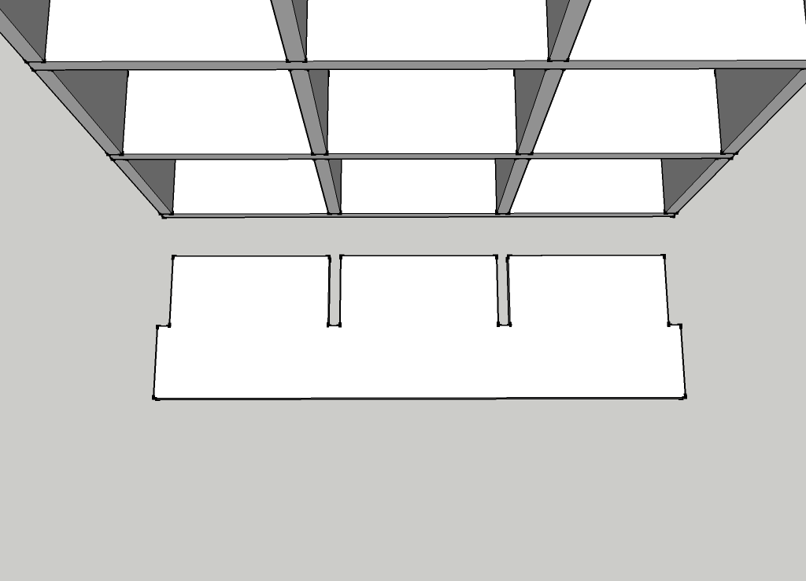

cubby-grid
==========

A nine by nine grid of square cubbies made from eight boards with the same cuts. 

[View](cubby-grid.stl) | [Download](https://github.com/jniesen/cubby-grid/raw/master/cubby-grid.skp)

-----

 This work is licensed under a <a rel="license" href="http://creativecommons.org/licenses/by-nc/4.0/">Creative Commons Attribution-NonCommercial 4.0 International License</a>.

